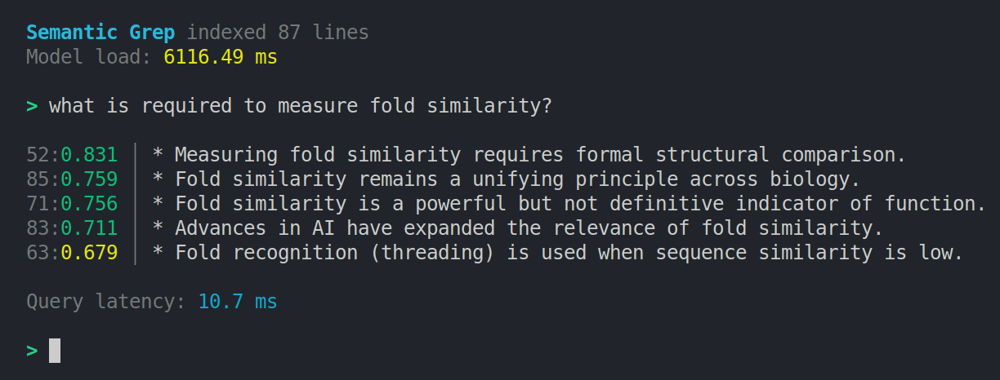

<p align="center">
  
</p>

<h2 align="center">Spheni</h2>

<p align="center">
  A tiny CPU-first, in-memory vector search library in C++ with Python bindings.
</p>

<p align="center">
  <a href="LICENSE"></a>
  <a href="https://discord.gg/XPrAs44vdH"></a>
</p>

## Index

1. [Overview](#overview)
2. [Features](#features)
3. [Applications](#applications)
4. [Getting Started](#getting-started)
5. [Examples](#examples)
6. [Benchmarks](#benchmarks)
7. [Architecture](#architecture)
8. [Status](#status)
9. [Roadmap](#roadmap)
10. [License](#license)
11. [Disclosure](#disclosure)

## Overview

Spheni is a C++ library with Python bindings to search for points in space that are close to a given query point. The aim is to build-and-document the [architectural](docs/arch/) and [performance improvements](docs/benchmarks/benchmarks.md) over time.

## Features

1. Indexes: Flat, IVF
2. Metrics: Cosine, L2
3. Storage: F32, INT8
4. Ops: add, search, search_batch, train, save, load

Check out the API references for full details:

- [Python API](docs/wiki/python_api.md)
- [C++ API](docs/wiki/cpp_api.md)

## Applications

### Semantic Image Search

Spheni manages the low-level indexing and storage of CLIP-generated embeddings to enable vector similarity calculations. It compares the mathematical representation of a text query against the indexed image vectors to find the best semantic matches.


### Semantic `grep`

It retrieves relevant lines based on meaning rather than exact keywords.
It embeds text once and uses Spheni for fast, offline vector search.



## Getting Started

Command launcher note:
- Linux/macOS: use `python3` if `python` is not available.
- Windows: use `py` (for example, `py -m pip install spheni`).

### Quick Start (Python package)

Install from PyPI:

```bash
python -m pip install --upgrade pip
python -m pip install spheni
```

Verify:

```bash
python -c "import spheni; print(spheni.__version__)"
```

### Build From Source (C++ / local Python module)

Git clone and navigate into the root directory.
Have CMake, pybind11 and OpenMP installed.

Build from the repo root:

```bash
./build_spheni.sh --python --install ./dist
```

Check out the [full guide](docs/wiki/building.md).

Build a local wheel (PEP 427):

```bash
python -m pip install --upgrade pip
python -m pip wheel . --no-deps -w dist
```

For local-only source builds, you can enable native CPU tuning with:

```bash
cmake -S . -B build -DCMAKE_BUILD_TYPE=Release -DSPHENI_BUILD_PYTHON=ON -DSPHENI_ENABLE_MARCH_NATIVE=ON
cmake --build build
```

## Examples

C++:

```cpp
#include "spheni/engine.h"
#include <vector>

int main() {
    spheni::IndexSpec spec(3, spheni::Metric::L2, spheni::IndexKind::Flat, false);
    spheni::Engine engine(spec);
    std::vector<float> data = {1,0,0, 0,1,0, 0,0,1};
    engine.add(data);
    std::vector<float> query = {0.1f, 0.9f, 0.0f};
    auto hits = engine.search(query, 1);
}
```

Python:

```python
import numpy as np
import spheni

spec = spheni.IndexSpec(4, spheni.Metric.L2, spheni.IndexKind.Flat)
engine = spheni.Engine(spec)

base = np.random.rand(10, 4).astype(np.float32)
engine.add(base)

query = np.random.rand(4).astype(np.float32)
results = engine.search(query, 3)

for hit in results:
    print(f"ID: {hit.id}, Score: {hit.score}")
```

## Benchmarks

IVF achieves ~97% Recall@10 with ~12x higher throughput than brute force and stable tail latency.
INT8 quantization reduces memory by ~73% with negligible accuracy loss, and OpenMP parallelism adds ~2.4x more throughput.


Read the full [benchmark report](docs/benchmarks/benchmarks.md).

## Architecture

Architecture snapshot reference: [`docs/arch/v0.1.1.md`](docs/arch/v0.1.1.md).

Current code is split by responsibility:

- `include/spheni/`: public API (`IndexSpec`, `Engine`, enums, contracts)
- `src/core/`: orchestration/factory (`Engine`, index dispatch)
- `src/indexes/`: index algorithms (`FlatIndex`, `IVFIndex`)
- `src/math/`: shared math kernels and utilities (`kernels`, `kmeans`, `TopK`)
- `src/storage/`: storage-specific transforms (`quantization`)
- `src/io/`: binary serialization helpers
- `src/python/`: pybind11 bindings

Contributor workflow:

1. Add/modify algorithm behavior in `src/indexes/`.
2. Add reusable scoring/math in `src/math/` (instead of duplicating in indexes).
3. Add representation-specific behavior in `src/storage/`.
4. Keep persistence logic in index state serializers and `src/io/`.

Lifecycle contracts:

- `Engine::train()` is explicit and currently IVF-only.
- `IVFIndex::add()` buffers vectors before training; `IVFIndex::search()` requires trained state.
- `SearchParams.nprobe` is an IVF query-time control (coarse clusters scanned).
- Cosine normalization is controlled by `IndexSpec.normalize` and applied on add/query where relevant.

## Status

Spheni is usable for experimentation and benchmarking, but not production-ready.

Current limitations:

- No SIMD kernels
- No deletion or updates
- Limited parameter validation
- IVF uses brute-force centroid assignment

## Roadmap

Short term:

- [ ] Parameter validation + explicit error handling [partially done]
- [x] Expose IVF training state
- [ ] Improve IVF memory locality
- [ ] Flat index optimizations

Longer term:

- [ ] SIMD kernels
- [x] Multithreading (just query search)
- [x] Persistence
- [X] Quantized storage (INT8 : Scalar Quantization)
- [ ] Additional ANN structures

## References

1. FAISS: [ArXiv Paper](https://arxiv.org/pdf/2401.08281)
2. [Near Neighbor Search in Large Metric Spaces](https://vldb.org/conf/1995/P574.PDF)
3. [The Binary Vector as the Basis of an Inverted Index File](https://ital.corejournals.org/index.php/ital/article/view/8961/8080)

## License

Apache 2.0

## Disclosure

This project used AI assistance (Codex) to generate the serialization, exception-handling and python bindings. Claude Sonnet 4.5 was used to iteratively brainstorm the architecture, the prompt for which can be found [here](https://github.com/datavorous/prompts/blob/master/claude/architect.xml).

Other than that, some inspiration and references were taken from the following projects/forums:

1. [tinyvector](https://github.com/0hq/tinyvector)
2. [comet](https://github.com/wizenheimer/comet)
3. [r/database reddit thread](https://www.reddit.com/r/Database/comments/1nyigk3/how_hard_would_it_be_to_create_a_vector_db_from/)
