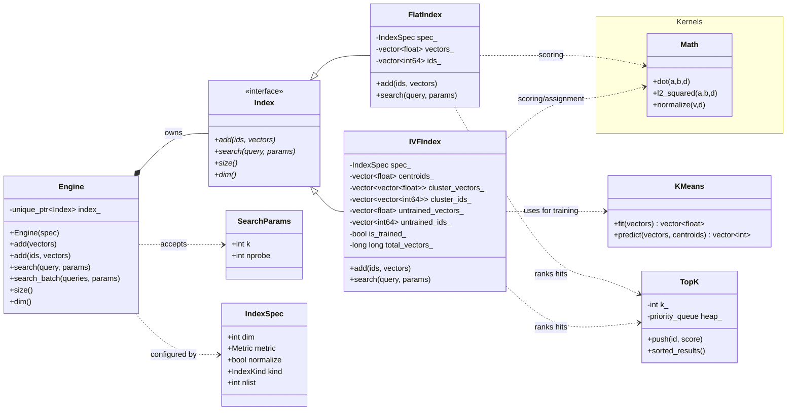
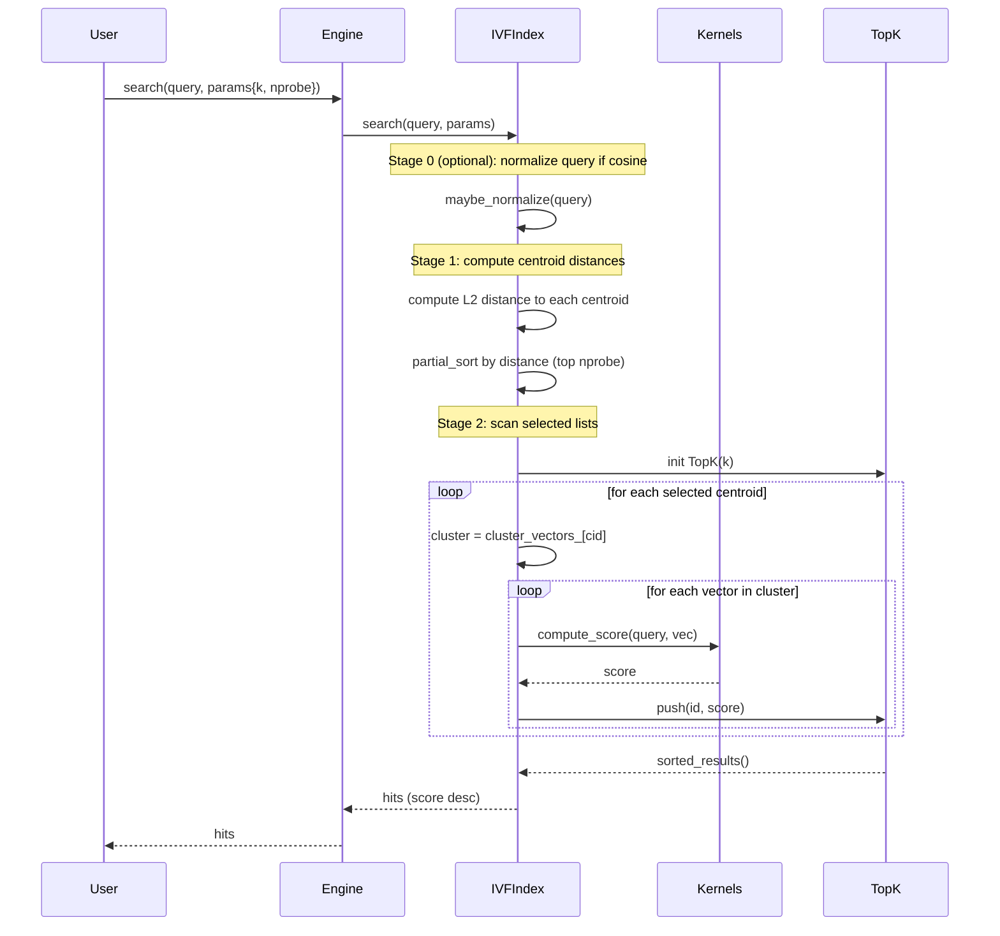

# Notes

This is what we are supposed to implement.

> [!WARNING]
> This file is historical and partially outdated.
> For current behavior and module layout, see `docs/arch/v0.0.4.md`.
>
> Notable drift from this doc:
> - IVF training is explicit (`Engine::train`) and not auto-triggered in `add`.
> - IVF search does not fall back pre-train; it throws until trained.
> - Source tree has been modularized into `core/indexes/math/storage/io`.

## Core Architecture (as implemented)

## Implementation details (current)

- **Training trigger:** `IVFIndex::train()` runs during `add(...)` when the index is not yet trained and enough vectors are available (`n >= nlist`). Until then, vectors/ids are buffered in `untrained_vectors_` / `untrained_ids_`.
- **Training algorithm:** Uses `clustering::KMeans` with k-means++ style initialization and a fixed RNG seed (42). Centroids are computed from buffered vectors, then each buffered vector is assigned to its nearest centroid to populate `cluster_vectors_` and `cluster_ids_`.
- **Post-train ingestion:** Once trained, new vectors are assigned to their nearest centroid via a brute-force centroid scan and appended to that cluster’s storage.
- **Search behavior:**
  - If **not trained**, `search(...)` falls back to a flat scan over the untrained buffer.
  - If **trained**, the query is normalized (cosine only), distances to all centroids are computed, and the closest `nprobe` clusters are scanned.
  - Scores are **dot product** for cosine and **negative L2 squared** for L2.
- **Normalization:** When `normalize=true` and `metric=Cosine`, both vectors (at add time) and queries (at search time) are L2-normalized.
## Search Logic (as implemented)

