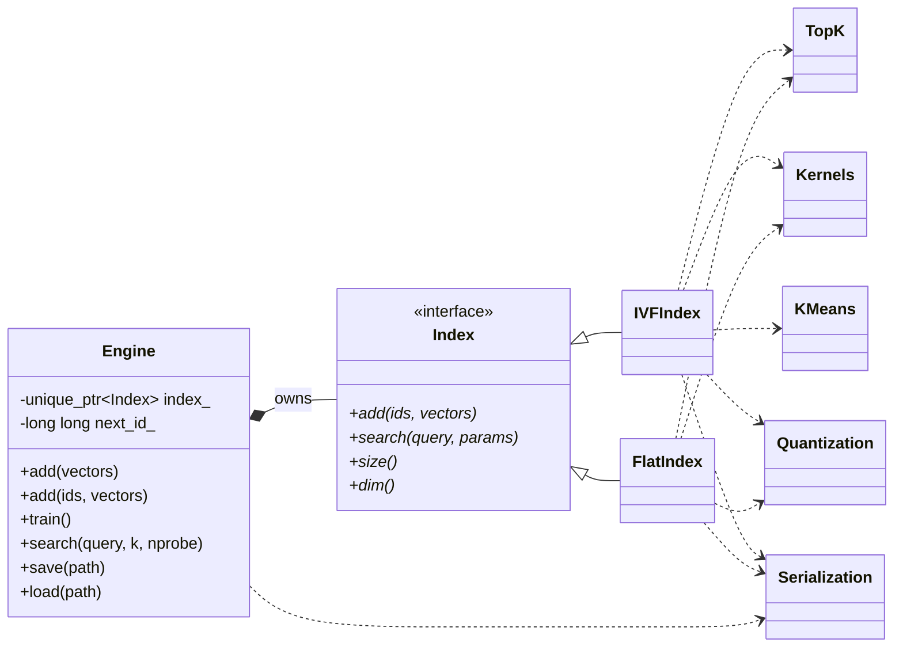

# Notes

This document reflects the current architecture after module-boundary cleanup.

## Module Layout

- `include/spheni/`: public API contracts
- `src/core/`: `Engine` orchestration + `make_index` factory
- `src/indexes/flat/`: exact-search index implementation
- `src/indexes/ivf/`: IVF implementation (training, add, search)
- `src/math/`: shared kernels, k-means, top-k helper
- `src/storage/`: scalar quantization helpers
- `src/io/`: binary read/write helpers
- `src/python/`: bindings

## Core Architecture (current)

## Lifecycle Contracts

- `Engine` chooses concrete index via `make_index(spec)`.
- `Engine::train()` is explicit and valid only for IVF.
- `IVFIndex::add()` buffers vectors while untrained.
- `IVFIndex::search()` throws if called before training.
- `SearchParams.nprobe` controls IVF coarse-search breadth.

## Data Flow

### Add

1. `Engine::add` receives vectors (auto-id or user ids).
2. `Index::add` stores data according to index kind and storage type.
3. Cosine normalization is applied when `spec.normalize == true`.

### Train (IVF)

1. `IVFIndex::train` consumes buffered vectors.
2. `math::clustering::KMeans` computes centroids/assignments.
3. Vectors are repartitioned into inverted lists.
4. Index transitions to trained state.

### Search

1. Query normalization happens for cosine when enabled.
2. IVF coarse search ranks centroids by L2 and picks `nprobe`.
3. Selected lists are scanned and merged via `math::TopK`.
4. Results are returned score-descending.

## Persistence

- `Engine::save/load` persists:
  - `IndexSpec` fields
  - `next_id_`
  - index state payload (`FlatIndex`/`IVFIndex`)
- Serialization uses POD/vector helpers in `src/io/serialize.h`.
- Load performs structural validation (dims, enum ranges, shape consistency).
