# Notes

Looked into ivf, and parallelized the search function.

> [!NOTE]
> This file describes the parallel IVF search idea and is still directionally valid.
> For current module layout and full architecture contracts, see `docs/arch/v0.4.md`.

"Coarse Search" now uses all the cores to find the closest clusters.

Solved thread contention problem by using giving each thread their own private `TopK` head. Once done, the best results from each is merged into the final `TopK`.

Also, used `schedule(dynamic)` such that a thread that finishes a small cluster quickly will immediately jump to help with the next one, rather than sitting idle.

```mermaid
---
config:
  theme: dark
---
graph TD
    A[User Query] --> B{IVF Search}
    
    subgraph "Phase 1: Coarse Search"
        B --> C1[Centroid 1 Score]
        B --> C2[Centroid 2 Score]
        B --> C3[Centroid N Score]
        C1 & C2 & C3 --> D[partial_sort to find nprobe=12 clusters]
    end

    subgraph "Phase 2: Fine Search"
        D --> E1[Thread 1: Scan Cluster A]
        D --> E2[Thread 2: Scan Cluster B]
        D --> E3[Thread 3: Scan Cluster C]
        D --> E4[Thread 4: Scan Cluster D]
        
        E1 --> F1[(Local TopK 1)]
        E2 --> F2[(Local TopK 2)]
        E3 --> F3[(Local TopK 3)]
        E4 --> F4[(Local TopK 4)]
    end

    subgraph "Phase 3: Reduction"
        F1 & F2 & F3 & F4 --> G[Merge into Global TopK]
        G --> H[Final Sorted Results]
    end

    style B fill:#800080,stroke:#fff,stroke-width:2px
    style E1 fill:#1a1a4d,stroke:#fff
    style E2 fill:#1a1a4d,stroke:#fff
    style E3 fill:#1a1a4d,stroke:#fff
    style E4 fill:#1a1a4d,stroke:#fff
    style G fill:#004d00,stroke:#fff
```

