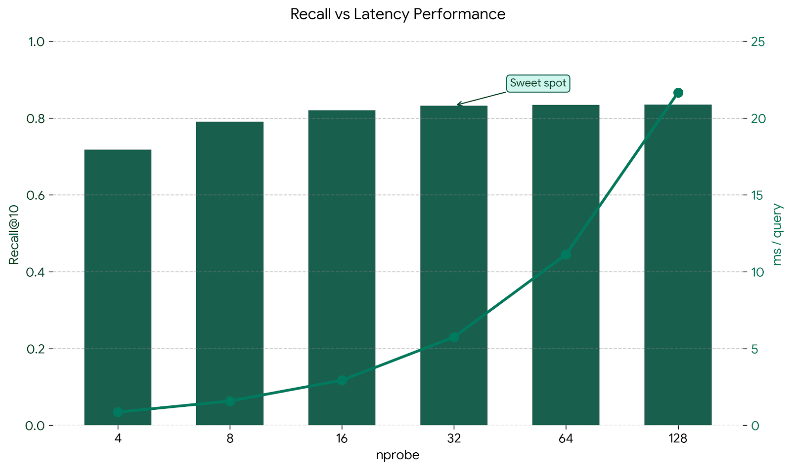
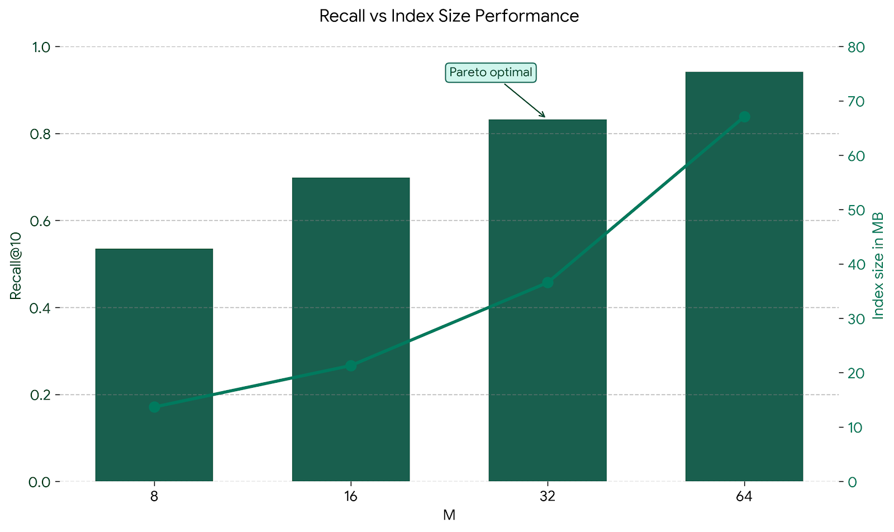
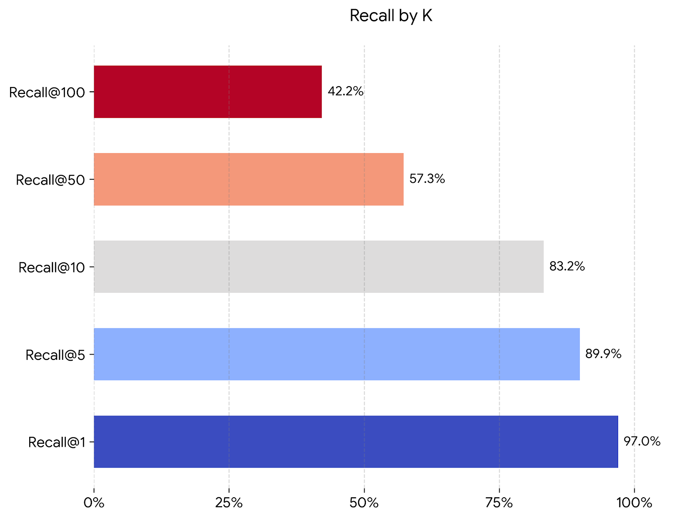

# IVF-PQ Benchmark

**Date:** March 16, 2026

**Hardware:** Intel Core i7-8650U (4C/8T, 1.9GHz - 4.2GHz, 15W TDP)

Performance and memory characterization of the IVF-PQ index on a 1-million-vector dataset at 768 dimensions (Cohere embeddings, cosine similarity). Check out the [legacy](legacy/benchmarks/benchmarks.md) benchmark for prior experiments.

## Setup

| Parameter | Value |
|---|---|
| Dataset | Cohere 1M, dim=768 |
| Vectors | 1,000,000 |
| Metric | Cosine (normalized) |
| Evaluation metric | Recall@k-in-100 |
| Training subset | 30,000 vectors |
| Eval queries | 200 |
| Candidate k | 100 |
| nlist | 512 |
| ksub | 256 |
| CPU execution | Single core |

## Memory

From the sweep-run baseline (M=32, nlist=512, nprobe=32):

| Quantity | Value |
|---|---|
| Raw vectors | 2929.69 MB |
| Index memory | 36.58 MB |
| Compression ratio (raw/index) | 80.1x |

## Sweeps

### Sweep 1 :: nprobe (nlist=512, M=32, ksub=256, train_n=30k)

Baseline build time: 849.08 s

| nprobe | Recall@10-in-100 | QPS | ms/query |
|---|---:|---:|---:|
| 4 | 0.7180 | 1246.6 | 0.802 |
| 8 | 0.7910 | 702.6 | 1.423 |
| 16 | 0.8210 | 368.5 | 2.714 |
| 32 | 0.8325 | 186.9 | 5.350 |
| 64 | 0.8345 | 92.9 | 10.769 |
| 128 | 0.8355 | 48.0 | 20.820 |

Observed recall deltas (percentage points):

- 4 -> 8: +7.30 pp
- 8 -> 16: +3.00 pp
- 16 -> 32: +1.15 pp
- 32 -> 64: +0.20 pp
- 64 -> 128: +0.10 pp
- 32 -> 128: +0.30 pp

### Sweep 2 :: M (nlist=512, nprobe=32, ksub=256, train_n=30k)

| M | Index MB | Compression (x) | Recall@10-in-100 | QPS | Build (s) |
|---|---:|---:|---:|---:|---:|
| 8 | 13.69 | 213.9 | 0.5350 | 451.4 | 794.36 |
| 16 | 21.32 | 137.4 | 0.6990 | 335.1 | 802.33 |
| 32 | 36.58 | 80.1 | 0.8325 | 191.1 | 852.89 |
| 64 | 67.10 | 43.7 | 0.9420 | 100.2 | 1127.13 |

Observed recall deltas (percentage points):

- 8 -> 16: +16.40 pp
- 16 -> 32: +13.35 pp
- 32 -> 64: +10.95 pp
- 8 -> 64: +40.70 pp

### Sweep 3 :: Recall@k-in-100 (nprobe=32, M=32)

| Metric | Value |
|---|---:|
| Recall@1-in-100 | 0.9700 |
| Recall@5-in-100 | 0.8990 |
| Recall@10-in-100 | 0.8325 |
| Recall@50-in-100 | 0.5733 |
| Recall@100-in-100 | 0.4220 |

### Sweep 4 :: Recall vs latency (M=32, nlist=512)

| nprobe | Recall@10-in-100 | ms/query | QPS | lists% |
|---|---:|---:|---:|---:|
| 4 | 0.7180 | 0.862 | 1159.5 | 0.8 |
| 8 | 0.7910 | 1.584 | 631.4 | 1.6 |
| 16 | 0.8210 | 2.935 | 340.7 | 3.1 |
| 32 | 0.8325 | 5.746 | 174.0 | 6.2 |
| 64 | 0.8345 | 11.127 | 89.9 | 12.5 |
| 128 | 0.8355 | 21.669 | 46.1 | 25.0 |

## Summary

Run summary values (from benchmark output):

| Field | Value |
|---|---|
| Dataset | Cohere 1M, dim=768 |
| Vectors | 1,000,000 |
| Train subset | 30000 |
| Metric | Cosine (normalized) |
| Eval queries | 200 |
| Candidate k | 100 |
| Baseline config | M=32, nlist=512, nprobe=32 |
| Baseline index size | 36.58 MB |
| Baseline raw size | 2929.69 MB |
| Baseline compression | 80.1x |
| Baseline Recall@10-in-100 | 0.8325 |
| Baseline QPS | 174.7 (5.725 ms/query) |

## Caveats

- Results are from a single-core CPU benchmark run.
- Evaluation uses 200 queries.
- Reported recall values are Recall@k-in-100, not full-dataset Recall@k.
- Sweep 1 and Sweep 4 both vary nprobe, but timing numbers differ because they are separate measurement sections in the same benchmark run.