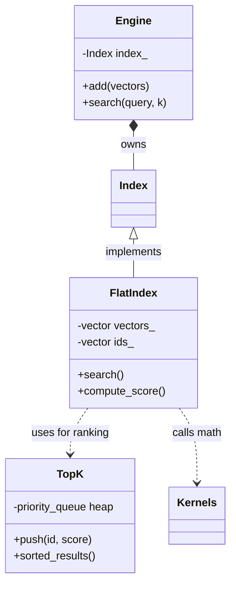
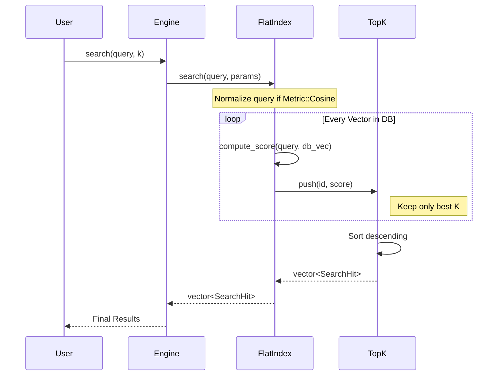

# Notes

In version 0.1, spheni is a functional, header-only-friendly C++ vector search library that implements a brute-force "Flat" index.  
It handles the basic lifecycle of vector data: ingestion, normalization, and similarity searching.

## Core Architecture 

The `Engine` acts as the primary entry point. It manages automatic ID generation (`next_id_`) and abstracts away the underlying index implementation.

Then we have a polymorphic base class (`spheni::Index`) that allows for future expansion.  
We use something called factory pattern: `make_index` to instantiate implementations, currently defaulting to `FlatIndex`.

Currently we support the following metrics:

1. Cosine Similarity: Implemented via dot product on normalized vectors.
2. L2 Distance: Implemented as Euclidean distance (returned as a negative score to maintain "higher is better" ranking).

Then we got **Top-K Logic** which uses a **Min-Heap** (`std::priority_queue`) to efficiently track the best results during a full scan, ensuring O(N log K) complexity rather than O(N log N).

Additionaly, if specified in the `IndexSpec`, the library automatically converts vectors to unit length during both `add` and `search` operations.  

The `Engine` supports `search_batch` to process multiple queries in a single call.  
Both user-provided 64-bit IDs and auto-incrementing internal IDs are supported.

## Search Logic

