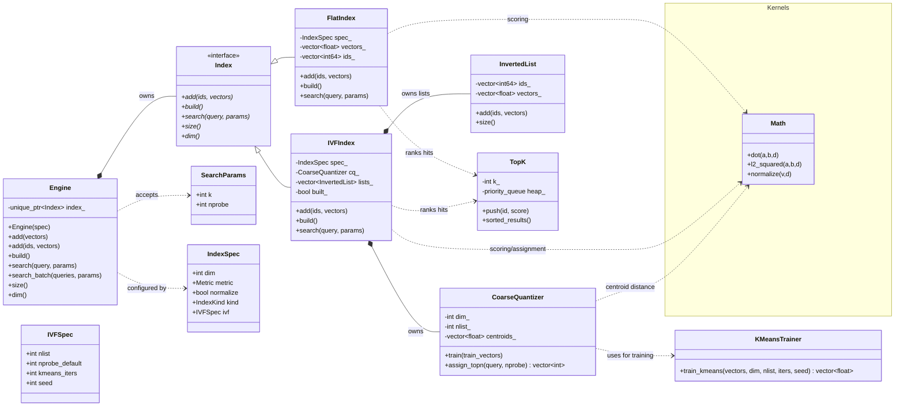
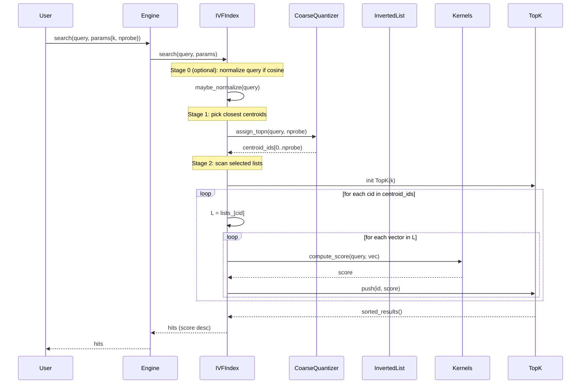

# Notes

This is what we are supposed to implement.

## Core Architecture

```mermaid
classDiagram
    direction LR

    class Engine {
        -unique_ptr~Index~ index_
        +Engine(spec)
        +add(vectors)
        +add(ids, vectors)
        +build()
        +search(query, params)
        +search_batch(queries, params)
        +size()
        +dim()
    }

    class Index {
        <<interface>>
        +add(ids, vectors)*
        +build()* 
        +search(query, params)*
        +size()*
        +dim()*
    }

    class SearchParams {
        +int k
        +int nprobe
    }

    class IndexSpec {
        +int dim
        +Metric metric
        +bool normalize
        +IndexKind kind
        +IVFSpec ivf
    }

    class IVFSpec {
        +int nlist
        +int nprobe_default
        +int kmeans_iters
        +int seed
    }

    class FlatIndex {
        -IndexSpec spec_
        -vector~float~ vectors_
        -vector~int64~ ids_
        +add(ids, vectors)
        +build()
        +search(query, params)
    }

    class IVFIndex {
        -IndexSpec spec_
        -CoarseQuantizer cq_
        -vector~InvertedList~ lists_
        -bool built_
        +add(ids, vectors)
        +build()
        +search(query, params)
    }

    class CoarseQuantizer {
        -int dim_
        -int nlist_
        -vector~float~ centroids_
        +train(train_vectors)
        +assign_topn(query, nprobe) vector~int~
    }

    class KMeansTrainer {
        +train_kmeans(vectors, dim, nlist, iters, seed) vector~float~
    }

    class InvertedList {
        -vector~int64~ ids_
        -vector~float~ vectors_
        +add(ids, vectors)
        +size()
    }

    class TopK {
        -int k_
        -priority_queue heap_
        +push(id, score)
        +sorted_results()
    }

    namespace Kernels {
        class Math {
            +dot(a,b,d)
            +l2_squared(a,b,d)
            +normalize(v,d)
        }
    }

    Engine *-- Index : owns
    Engine ..> IndexSpec : configured by
    Engine ..> SearchParams : accepts

    Index <|-- FlatIndex
    Index <|-- IVFIndex

    IVFIndex *-- CoarseQuantizer : owns
    IVFIndex *-- InvertedList : owns lists
    CoarseQuantizer ..> KMeansTrainer : uses for training

    FlatIndex ..> TopK : ranks hits
    IVFIndex ..> TopK : ranks hits

    FlatIndex ..> Math : scoring
    IVFIndex ..> Math : scoring/assignment
    CoarseQuantizer ..> Math : centroid distance
```
## Search Logic

```mermaid
sequenceDiagram
    participant U as User
    participant E as Engine
    participant IVF as IVFIndex
    participant CQ as CoarseQuantizer
    participant L as InvertedList
    participant K as Kernels
    participant T as TopK

    U->>E: search(query, params{k, nprobe})
    E->>IVF: search(query, params)

    Note over IVF: Stage 0 (optional): normalize query if cosine
    IVF->>IVF: maybe_normalize(query)

    Note over IVF: Stage 1: pick closest centroids
    IVF->>CQ: assign_topn(query, nprobe)
    CQ-->>IVF: centroid_ids[0..nprobe)

    Note over IVF: Stage 2: scan selected lists
    IVF->>T: init TopK(k)

    loop for each cid in centroid_ids
        IVF->>IVF: L = lists_[cid]
        loop for each vector in L
            IVF->>K: compute_score(query, vec)
            K-->>IVF: score
            IVF->>T: push(id, score)
        end
    end

    T-->>IVF: sorted_results()
    IVF-->>E: hits (score desc)
    E-->>U: hits
```